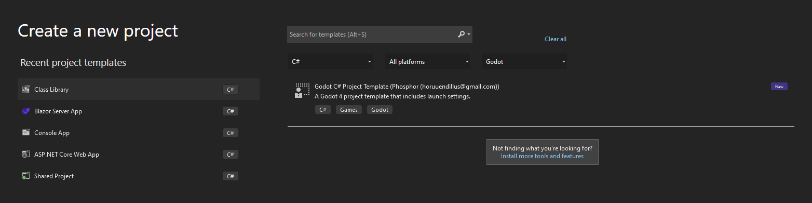
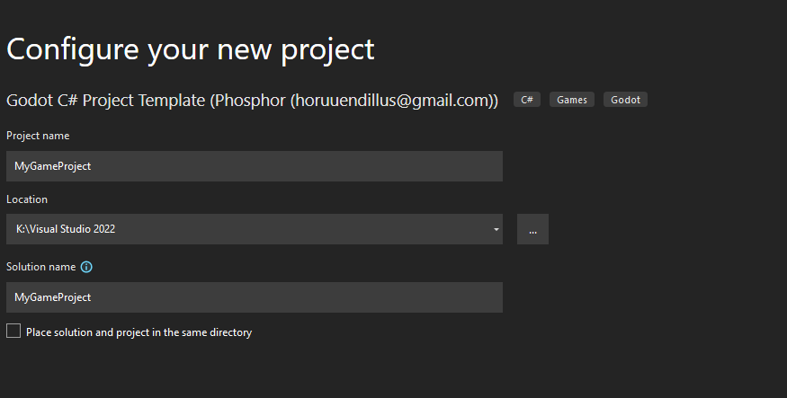
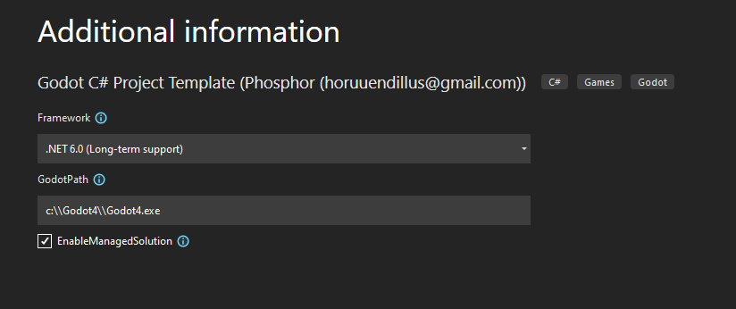

# GodotNetProjectTemplate

A project template for creating a Godot .Net core project for the Godot game engine.

Hopefully I'll have nuget packages soon to ease the install process.

### Installing

Clone Repo

Copy the Godot.Net.Template folder to where you want it live, as this is the template source that will be used for generation.  
So remember to uninstall the template before deleting the folder.

After copying the folder, open a terminal in the Godot.Net.template folder and execute:

### Net 7.0

    Windows:

    dotnet new install .\

    Linux:

    dotnet new install ./

    Mac:

    dotnet new install ./

### Net 6.0

    Windows:

    dotnet new --install .\

    Linux:

    dotnet new --install ./

    Mac:

    dotnet new --install ./

### Usage is simple

`dotnet new Godot -o {NameOfProject} -G {PathToGodtotExe}`

Note on windows it is currently necessary to escape the back slashes in the godot exe path, for example if the exe is

`C:\Godot\Godot4.exe`

You would use:

`dotnet new Godot -o {NameOfProject} -G c:\\Godot\\Godot4.exe`

This will create a project that already has the necessary launch settings for running or debugging your code in Visual Studio or Jetbrains' Rider.

After creating the project simply open it in the Godot editor and start working.

If you are creating the project as a child project of a solution,then you would pass a third argument to dotnet new , setting EnabledManagedSolution to true like so:

`dotnet new Godot -o {NameOfProject} -G {PathToGodtotExe} -E true`

This will cause the solution path in the Godot project to point one folder up.

If this option is not enabled and you are creating the project in Visual Studio you will end up with two solution files.  One in the project folder, and the one created by VS.

If this happens, just delete the solution file in the project folder, and change the project settings to point to the solution file created by Visual Studio.  For more information see below.

It is not recommended to use the template directly in Rider as there currently seems to be no way to set the custom parameters.

By default the project is created targeting Net 6.0, if you wish it to target Net 7.0 then use the -F argument like so:

`dotnet new Godot -o {NameOfProject} -G {PathToGodtotExe} -F net7.0`

`dotnet new Godot -h` will return a list of the parameters and their descriptions.

Once the template is installed you can also use Visual Studio to create a Godot project.

Select the Godot project type from the project types.

Give it a Project Name:

Fill in the Path to the Godot exe (on windows use double back slashes), and check EnableManagedSolution

Once the project is created, when loaded in either in Rider or Visual Studio there will be two launch profile available immediately.  Player and Editor.

Use the player profile for running/debugging games and the editor profile for running/debugging plugins and tools.

In fact of these profiles can be launched immediately on creation, but because there is no main scene yet the player profile will simply report that and stop.

The editor profile will simply open the Godot editor at this point.

#### Changing Solution File in Godot Editor

Editor->Project Settings Enable advanced

Scroll down to Dotnet and set the solution folder to be the correct path.

This will automatically adjust the solution path in the Godot project file.

### Uninstalling

Open a terminal in the Godot.Net.template folder and execute:

### Net 7.0

    Windows:

    dotnet new uninstall .\

    Linux:

    dotnet new uninstall ./

    Mac:

    dotnet new uninstall ./

### Net 6.0

    Windows:

    dotnet new --uninstall .\

    Linux:

    dotnet new --uninstall ./

    Mac:

    dotnet new --uninstall ./
